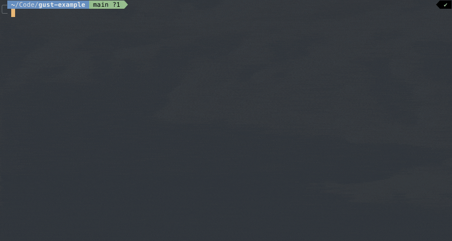

# Gust

As in, a burst of wind.

Gust is a simple CLI tool to generate Tailwind V4 theme files from Figma design tokens. It expects a JSON file generated by the [Design Tokens Figma Plugin](https://www.figma.com/community/plugin/888356646278934516/design-tokens) as an input.



> [!WARNING]
> This is a simple static tool that outputs a highly-opinionated structure for the CSS files and components it generates.
>
> It does not implement the full specifications of tokens that the above plugin may export, and may not catch tokens that do not follow the expected format.
>
> It is expected that you modify the output as needed after generation.
>
> I mostly made this for myself to avoid repetitive boilerplate when scaffolding a new application. Your mileage may vary.

## Setup

After cloning this repository, install the relevant dependencies. This project uses [pnpm](https://pnpm.io/installation) as its package manager, and is built with Node.JS and Typescript.

1. After ensuring you have the requirements noted above, run:

   ```sh
   pnpm install
   ```

   … in the root directory of the repo.

2. Generate a compiled version of the tool by running:

   ```sh
   pnpm build
   ```

3. Run the [`link` command](https://pnpm.io/cli/link) to makes the local package accessible system-wide, or in another location.

   ```sh
   pnpm link
   ```

## Usage

> [!NOTE]
> This package has not been published, and therefore cannot currently be added to a project from a remote package manager repository (eg, `npm`).

Gust can be run by running…

```sh
gust
```

Without any arguments, it will prompt the user to provide the necessary information for generating a Tailwind theme.

Arguments for all prompts can also be provided directly, by running:

```bash
gust [inputFile] -o [cssOutputDir] -t [createText] -co [componentOutputDir]
```

[inputFile] -o [cssOutputDir] -t [createText] -co [componentOutputDir]

### Arguments

- `[inputFile]`: (Optional) Path to the input JSON file containing Figma design tokens.

### Options

- `--output`/`-o`: (Optional) Path for the CSS output directory.
- `--component-output`/`-co`: (Optional) Path for the generate component output directory.
- `--create-text`/`-t`: (Optional) Flag for creating a React-based Text component.

## Utilities & useful commands

Common tooling, such as [ESLint](https://eslint.org/) for code linting, [Prettier](https://prettier.io) for code formatting, and [TypeScript](https://www.typescriptlang.org/) for static type checking, are all available as pnpm scripts.

To run relevant checks, use one of the commands below:

- `pnpm build` - Compile the tool and output the resulting artifacts.
- `pnpm format:fix` - Runs prettier and fixes formatting errors, if possible.
- `pnpm format` - Runs prettier and returns status indicating if formatting errors are present.
- `pnpm lint:fix` - Runs eslint and fixes formatting errors, if possible.
- `pnpm lint` - Runs eslint and returns status indicating if linting errors are present.
- `pnpm tsc` - Runs typescript and returns status indicating if static type-checking has passed.

To run the tool in development mode without building:

- `pnpm dev`

## Ideas for later

Honestly, I probably won't finish this:

- Match full spec of tokens that may be exported by Token Export plugin.
- Generate additional components.
- Generate stories.
- Just make this a "one-button" Figma plugin that creates a .zip file of the generated contents that designers can export and pass to devs directly.
